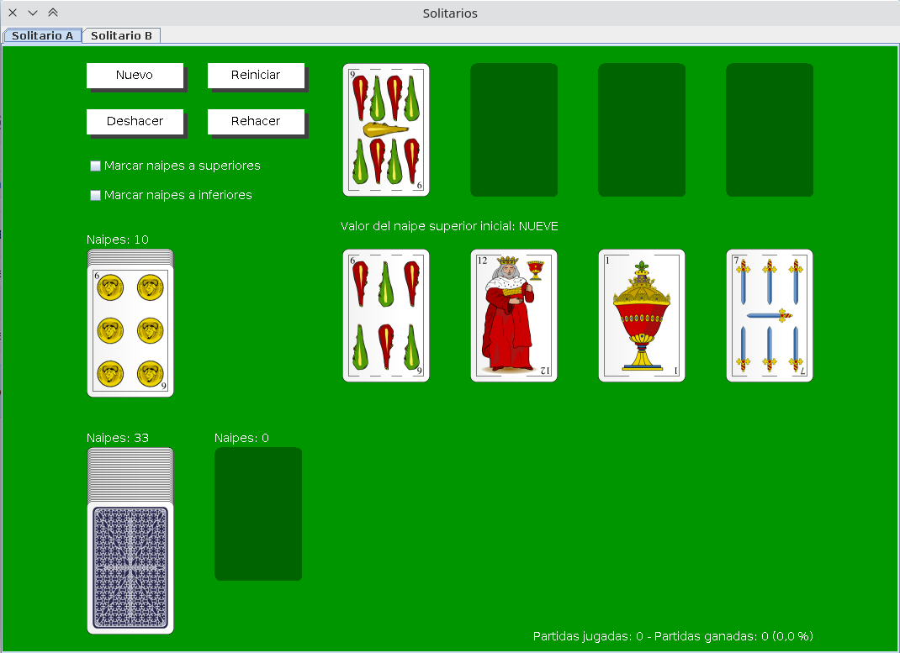
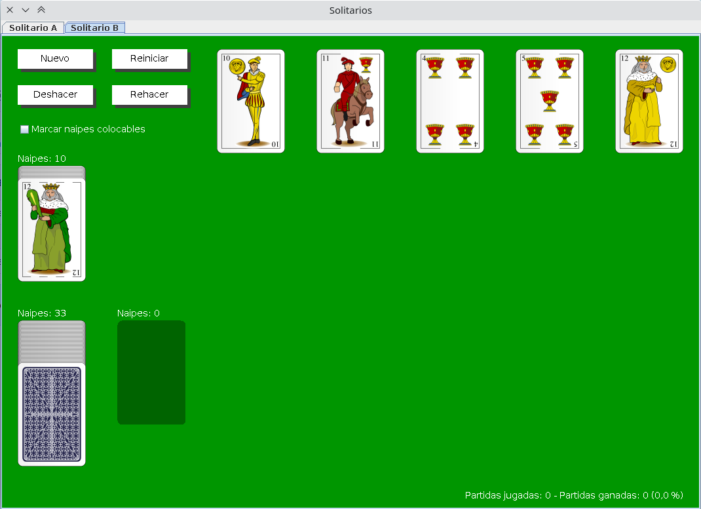

# Solitarios
Juego de solitarios

En este programa hay dos variantes de solitario.

## Solitario A

El más típico pero con baraja española. Se trata de ir poniendo naipes en los montos inferiores en orden decreciente siempre y cuando el palo sea distinto al de la última carta del monto. En los montos superiores los naipes se colocan de manera diferente: siguiendo orden ascendente y siempre del mismo palo.

El objetivo final es colocar todas las cartas en los cuatros montos superiores.

Si el jugador quiere puede marcar los naipes que se pueden colocar para faciliar el juego.

Un doble clic sobre una carta hace que ésta suba al monto superior que le toca (si es posible). Un doble clic derecho sube todas las cartas que pueden a montos superiores (especialmente útil cuando la partida ya está claramente resuelta).

## Solitario B

En este juego no hay montos superiores. Se siguen las mismas reglas que para los montos inferiores del solitario A.

El objetivo del juego es colocar todas las cartas en los montos inferiores.

Al igual que en el juego A, los naipes se pueden marcar.

